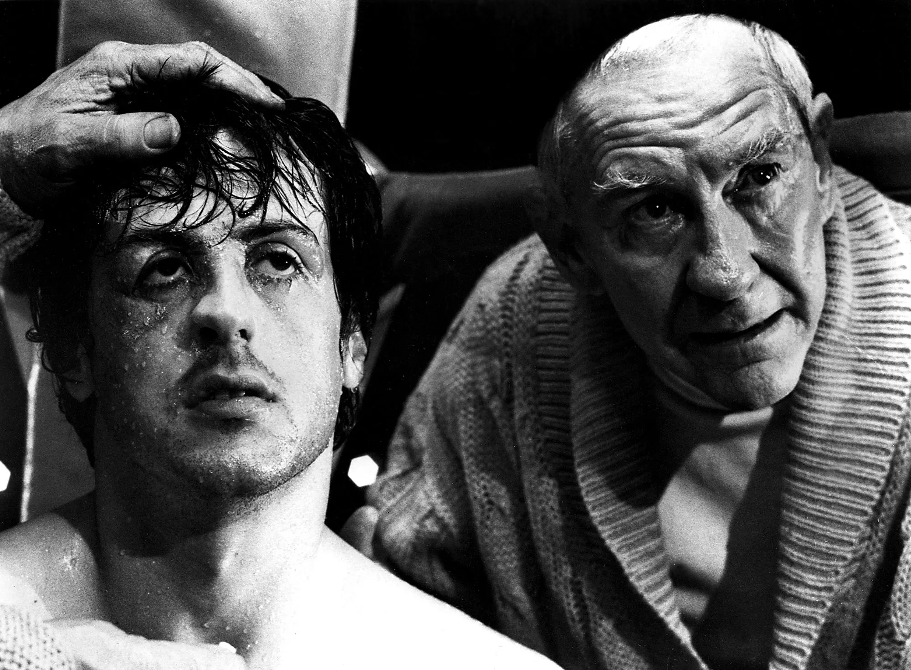

+++
draft = false
date = 2024-02-12T08:45:30+01:00
title = "Going back(end) to the old gym!"
description = "There and back(end) again: a developer's tale yet to be concluded."
slug = ""
authors = []
tags = ["vipps mobilepay", "career", "programming", "app development", "kotlin", "android", "life", "jesus"]
+++

It's official! I'm transitioning back from [my pilgrimage as an Android developer](/posts/changing-jobs-without-leaving-your-company), going back to my backend roots. Ah, the glorious smell of rusty metal, engine oil and buzzing CRT monitors running nothing but `vim`. The bonus is I still get to do Android! **More importantly, though, I'm back to working 80%**. Sweet, glorious Jesus, YES! And there's actually deeper stuff going on beneath the surface as well. Paradigm shift: √

## Context switching, begone!

Speaking of Jesus, he said that he came that we would have _life abundantly_ (John 10, 10). I want that, for real, in every possible way. And for the time being, A) working full weeks, and B) being at the beck and call of numerous different teams doing this and that just isn't sustainable. Turns out I'm not quite wired to cope with all that. Don't get me wrong: I can "pull it off", I can be efficient, ruthless and just get stuff done. If I turn my notch to "overdrive" I can squeeze through all my tasks and obligations (and then some!) with time to spare. But I end up feeling "[...]thin, like butter scraped over too much bread," as Bilbo Baggins aptly put it. To be clear: Android isn't what's pulling me down, the way I've been working is. And I want it to stop.

> You used to be like supernatural but the worse thing happen that can happen to any fighter; you got civilized! [...] Let's get outta here, back to the old gym! (Mickey to Rocky, Rocky III)

Civilized in 2024, I propose, isn't laziness or reluctance to commit or not trying hard enough. Rather, it often looks like working at least full time, outsourcing your parenting and dividing your precious time on chasing the wind - all to win treasure, while not really treasuring anything. Not _quite_ present neither here nor there, least of all to what really matters. Being connected in all the wrong ways, and few of the right ones. So **I've decided not to be civilized**, because quite frankly I can't. Not while raising three giant killers, and not while being present with my wife, those important to me and my surroundings in general. Not while following a man, The Man, whose walking pace is often provocatively slow. There are far too many moving parts, and too much divided attention. To hell with the hustle: I need time and space for my soul to breathe and my heart to slow down, and I've learned that both how much I work and _how_ I work matter in this regard. If civilized means giving up on that "life abundantly", then I'm officially out.

## What to do?

So I'm ruthlessly eliminating things that sabotage the abundant life I was given, and when dealing with how I work it looks like this: instead of switching context all too often, being in a constant high gear moving between teams, I'll broaden my toolbox and confine myself to one team. More specifically I'll do both Android and backend (Spring/Kotlin) in the Benefits team of Vipps MobilePay. Hopefully I can learn how to slow down a bit as well, watching the scenery and enjoying the process, being mindful of who I'm becoming (more than how much I can get done - keep reading). And I'm setting aside one extra day per week to make sure I don't get lost; a day without work, Slack, email, coding or any of that. As a radical means to stay healthy, happy and to enjoy life abundantly, and as a safe-guard against slipping into Civilized. Having some margin in my life is a good thing, if ever there was one, so I want to be intentional about it.

## The plan

I've decided that it's more important to me who I'm becoming than how much I can get done. As offensive as that may sound to some in this day and age, I'm sticking to it. This year is more about finding life in healthy, sustainable rhythms than about checking off TODOs and reaching pre-determined goals. I firmly believe that a healthy and happy developer is the most efficient one, and the one who learns fastest and creates most value for his company. But even if I'm proven wrong, there are certain things I just won't compromise. Like Life, time, peace of mind, sleep, and margin. Like Jesus, more than anything. I think sometimes slowing down is the most aggressive thing you can do. Back to the old gym!

> Peace I leave with you; my peace I give you. I do not give to you as the world gives. **Do not let your hearts be troubled** and do not be afraid. (John 14: 27, emphasis added)

> Above all else, guard your heart, for everything you do flows from it. (Proverbs 4, 23)
