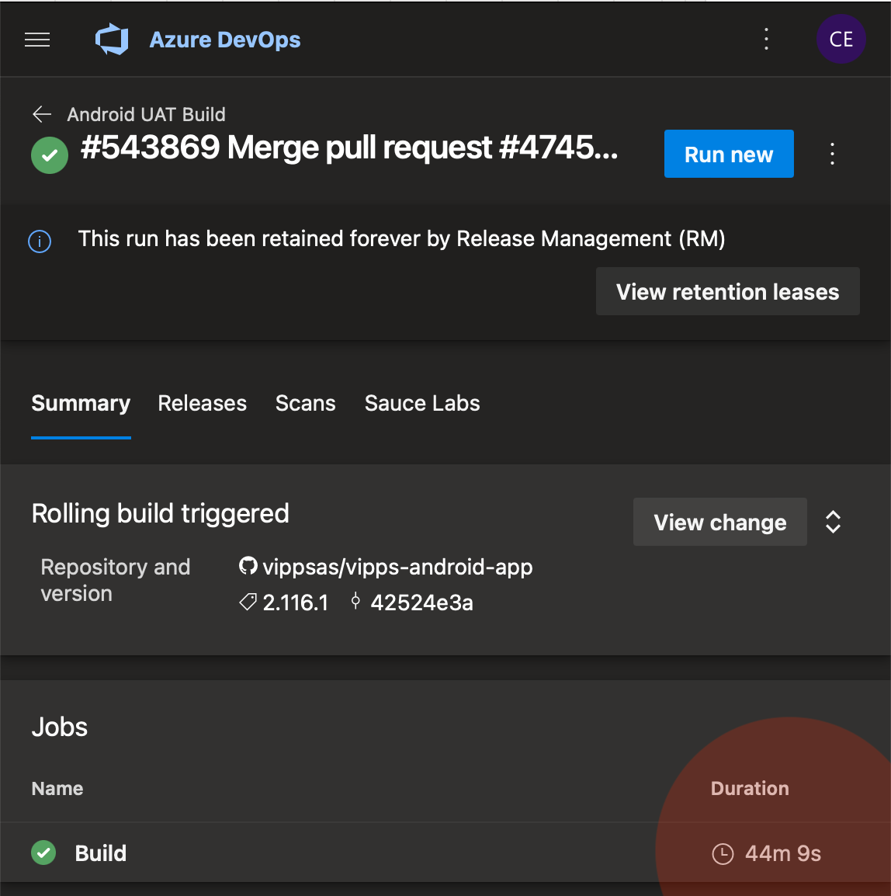
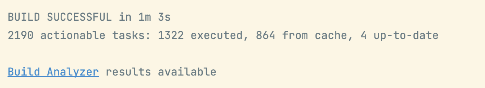
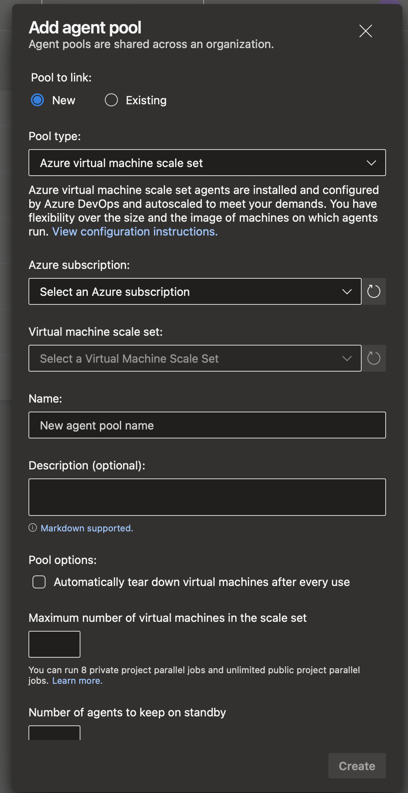
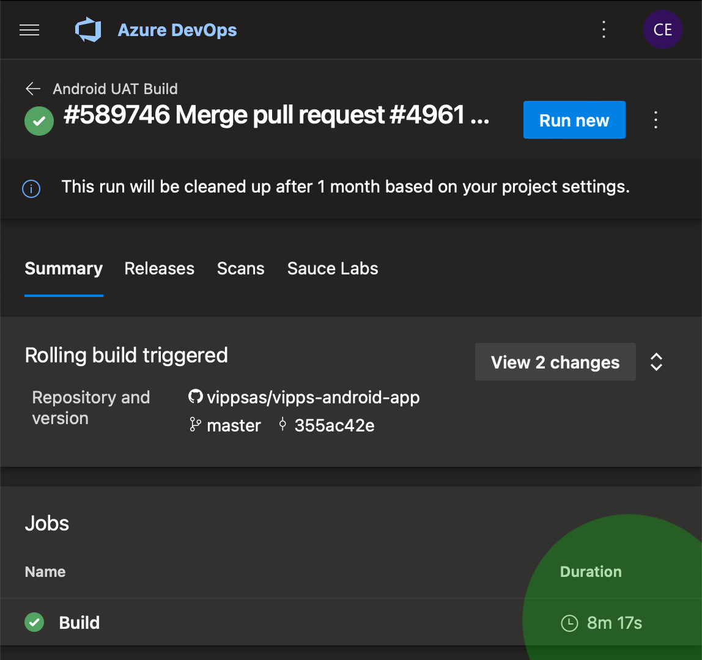

> A VMSS is, put as plainly as possible, a cluster of VMs that are scaled on-demand or manually.

## Context

The [Vipps App](https://play.google.com/store/apps/details?id=no.dnb.vipps&hl=no&gl=US) – until recently – took about 45 minutes to build on ~~A$ure~~ Azure. With a weekly release schedule, that might not sound like a huge dealbreaker, but since we're using a "feature branch" approach to how we do `git` (ie no `develop` branch; `master` should always be deployable-ish), we don't allow merging _anything_ to `master` without a successful cloud build. Waiting for code review is hard to avoid, but additionally waiting for slow builds is just wrong. It's not easy for our internal testers to check out what we're doing either, they _too_ are kept waiting. Suffice to say, the pain has been real. Personally, coming from a Golang background (where builds happen at the speed of your monitor's refresh rate), this kind of wrecked my soul on a daily basis. Granted, Android builds are more complicated (I'm looking at you, Java ecosystem!) than single-binary Golang builds, but 40+ minutes for one app build is too slow nonetheless.

But like quite a few other companies dealing with payments and sensitive data, we're stuck on Azure. I guess if you can't do better than Azure, you can do better _on_ Azure.



## What sparked us to make a change?

TL;DR: The M1 chip:



I think we've grown a bit accustomed to builds just being slow. Even locally on quite high-end hardware, we usually passed the 10-minute mark. But when we started using M1 MacBook pro's, we were once again reminded that builds don't _have_ to be slow, and the huge difference between local and cloud builds was once again very apparent. Initially I was hoping Azure might support macOS agents running on M1 hardware (which I'm sure they will eventually), but even without that I had to try _something_.

## A Virtual machine what-now?

We run most our Vipps builds on generic "Hosted agents", either running Ubuntu LTS or macOS. These agents come off the shelf pre-configured and pre-provisioned, with just about everything you need and then some. And, apparently, they're a lot slower than setting up your own stuff. One alternative is utilizing a [_Virtual Machine Scale Set_ (VMSS)](https://docs.microsoft.com/en-us/azure/virtual-machine-scale-sets/overview). This "Scale Set" is still hosted on Azure, but we're suddenly responsible for config and provisioning of the agents. A VMSS is, put as plainly as possible, a cluster of VMs that are scaled on-demand or manually. Our lead Android architect brought this option to my attention and suggested giving it a shot. Should be easy, right?

## Here be dragons, or – What sounds like a breeze, but really isn't in Azure land

#### Choosing which VM to use

A lesson learned early in Azure dealings is that **disks are usually the bottleneck of everything**. On VMSSs you have 4 options

- Standard HDD: unthinkably slow
- Premium SSD: still way too slow, and I suspect the main reason generic hosted agents are so slow
- [Ephemeral HDD](https://docs.microsoft.com/en-us/azure/virtual-machines/ephemeral-os-disks) as "temp/resource disk": faster, but not by any means fast
- Ephemeral HDD as "OS cache disk": as fast as it gets on Azure, which is not very fast but not ridiculously slow either. **This is what you want!**

An ephemeral disk is an actual disk physically mounted on the same hardware as the VM, which makes it a lot faster than any other disk accessed remotely. It's not entirely clear to me what the [placement of the ephemeral disk](https://docs.microsoft.com/en-us/azure/virtual-machines/ephemeral-os-disks) actually means, but there's a huge performance difference. I'm not sure why one would ever choose temp/resource over OS cache ¯\\_(ツ)_/¯

The next step is to find a VM that actually _supports_ the "right" ephemeral placement, and after some vigorous trial and error we decided on the [Standard_D16ds_v4](https://docs.microsoft.com/en-us/azure/virtual-machines/ddv4-ddsv4-series). It turns out 16 cores and 64GiB RAM is all you need for Azure to build something about 5 times slower than your laptop :D

```env
# Insane RAM usage? Yes, please
org.gradle.jvmargs=-Xms16g -Xmx48g -XX:+UseParallelGC
org.gradle.caching=true
org.gradle.parallel=true
```

A medium+ spec'ed VM with an ephemeral disk is faster than most top spec'ed über pricey tiers. I should charge you for that advice, given what I've gone through to find out. But I won't.

#### Connecting Azure DevOps to your new VMSS

After creating your scale set, you have to connect it to your build pipeline. You can try to do this from the Azure portal or the `az` CLI, but I think it's actually impossible. The "right" way is to register a new Build Agent from DevOps.



#### Finding out which permissions you need to make said connection

TL;DR: The "Application Developer" AD role is key, and must often be activated via PIM. Blessed are those who have never heard of these things.

#### Getting to know what software already exists on your new VMs

Well, not `unzip`, for starters. And speaking of software, Ubuntu 20LTS is basically broken beyond repair on Azure. 18LTS is better.

#### Figuring out ~~why~~ how Azure has broken said software (like `apt`)

The main gotcha here (besides not using Ubuntu 20) is that Azure has their own azurized `/etc/apt/sources.list` that works about 30% of the time. Be sure to fix that in your provisioning script!

#### Provisioning your VMs with what you need (to avoid downloading Java, Android SDK ++ for each build)

There are whispers and rumors of [cloudinit](https://cloudinit.readthedocs.io/en/latest/) and a few other approaches, but in practice you're pretty much running blind going most routes. No logging, no feedback, no sense of "did this run or not?". Adding a custom script extension kind of works, though. In order to load it from an external location and not an unstable azure blob, you need to add it using `az`, not the portal:

```
az vmss extension set -g [resource-group] --vmss-name [vmss-name] --name customScript --publisher Microsoft.Azure.Extensions --protected-settings '{"fileUris":["https://example.com/setup.sh"],"commmand": "bash setup.sh" }'
```

BUT, don't ever try to just change that script, or even change the script and re-run the above command. You risk Azure caching _half the script_(!!!) and essentially running half of the old and half of the new version. So be sure to change file name on each iteration. I'm serious.

Our `setup.sh` looks like this:

```bash
#!/bin/bash

# prepare for bashttle
set -e

 # let's do all logging to a file on the VM, and print it from the build pipeline (where we can actually see output...) # this ensures our builds have the provisioning debug log recorded in the build pipeline on DevOps
logFile="/var/log/debug"
currentUser=$(whoami)
sudo touch $logFile
sudo chown "$currentUser" $logFile

# if provisioning fails, print log to the terminal that's running the `az` command
cleanup() {
  ret=$?
  if [ $ret -ne 0 ]; then
    echo "Debug log:"
    cat $logFile
  fi

  exit $ret
}
trap cleanup EXIT

# make `apt` great again
cat <<EOF > /etc/apt/sources.list
###### Ubuntu Main Repos
deb http://no.archive.ubuntu.com/ubuntu/ bionic main restricted universe multiverse

###### Ubuntu Update Repos
deb http://no.archive.ubuntu.com/ubuntu/ bionic-security main restricted universe multiverse
deb http://no.archive.ubuntu.com/ubuntu/ bionic-updates main restricted universe multiverse
deb http://no.archive.ubuntu.com/ubuntu/ bionic-proposed main restricted universe multiverse
deb http://no.archive.ubuntu.com/ubuntu/ bionic-backports main restricted universe multiverse
EOF

# install java and unzip
sudo apt update >>$logFile
sudo apt -y install openjdk-11-jdk-headless unzip >>$logFile

# env vars
export java_dir=/usr/lib/jvm/java-11-openjdk-amd64
export android_dir=/home/AzDevOps/android-sdk
export PATH=$PATH:$android_dir/cmdline-tools/latest
export PATH=$PATH:$android_dir/cmdline-tools/latest/bin

echo "android dir: $android_dir" >>$logFile

# get and extract android command line tools
wget -O tools.zip https://dl.google.com/android/repository/commandlinetools-linux-8092744_latest.zip
mkdir -p $android_dir/cmdline-tools
unzip tools.zip -d $android_dir/cmdline-tools >>$logFile

# https://stackoverflow.com/questions/60440509/android-command-line-tools-sdkmanager-always-shows-warning-could-not-create-se
rm -rf $android_dir/cmdline-tools/latest
mv $android_dir/cmdline-tools/cmdline-tools $android_dir/cmdline-tools/latest

# install android SDK
yes | sdkmanager --licenses >>$logFile

sdkmanager "emulator" "tools" "platform-tools"
yes | sdkmanager \
  "build-tools;31.0.0" >>$logFile

yes | sdkmanager \
  "extras;android;m2repository" \
  "extras;google;m2repository" \
  "extras;google;google_play_services" >>$logFile

yes | sdkmanager \
  "platforms;android-31" >>$logFile

echo "All is well." >>$logFile

```

## And then, just like that

Change your `build.yaml`

```
      jobs:
      - job: Build
-     - pool: 'macOS-latest'
+     - pool: 'android-vmss-ephemeral'

[...]

+       - script: |
+           sudo cat /var/log/debug

```



I did have a beer. It was non-alcoholic.
