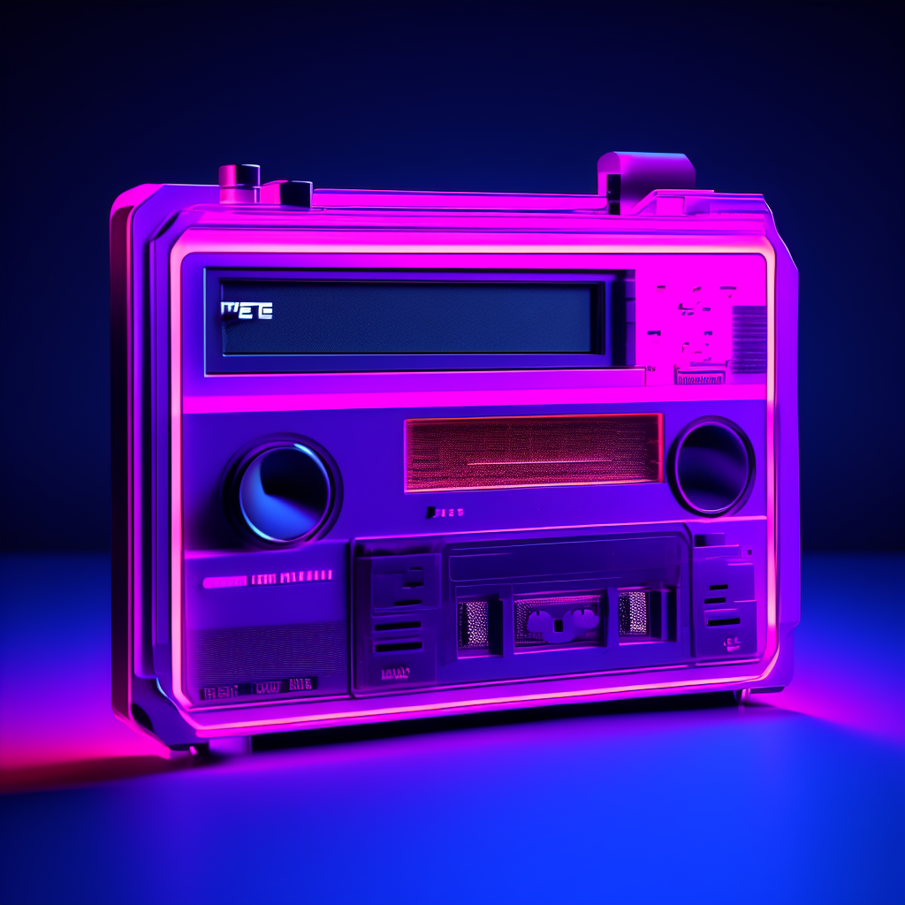

+++
draft = false
date = 2024-06-04T08:15:30+01:00
title = "I released an EP without recording a single track. No loops or midi either."
description = ""
tags = ["music", "AI", "Generative AI", "python", "open source", "life", "childhood", "gaming"]
+++

## Turbo Tape - Bit Blaster (EP)

OK, so here goes: an entire EP without a single track of audio that I recorded myself. What's more, I didn't even connect my MIDI keyboard! You can stream it on [Spotify](https://open.spotify.com/album/7t1lijjr9lKB3ilVaGhmVM?si=3NynQ5RGRdeSxzchWTTLdQ), [Apple Music](https://music.apple.com/us/album/bit-blaster-ep/1750032737), [YouTube](https://www.youtube.com/watch?v=-sz9yWBFBFM&list=OLAK5uy_mFUUQk8_HeMGOJiZWwj1SebgNTCdqUrV0&index=1) and probably everywhere else music is streamed. What invention describes the confusing mix of analog and digital means of conveying both data and audio than the [Turbo Tape](https://www.atarimagazines.com/compute/issue57/turbotape.html)?

AI album art looks nice, huh?

## "How", "why", and "how dare you"?

For now, I'll keep my cards close to the chest regarding the specifics of the "how", but suffice to say we're talking generative AI models capable of text-to- well, music. As for "why", I was mainly curious. Very curious. I'm actually trying to limit my own usage of AI assistance quite heavily. Sure I use some auto-complete (and friends) for my everyday coding tasks, but I often turn it all off I'm solving something complicated or feeling particularly creative. After all, what's the joy of flying if the auto pilot is always on? I'm also not buying in to the whole "AI is here to stay, it's not a matter of _if_ but _how_ we use it" mentality either – there are numerous areas of my life I don't want suggestions, opinions or hotfixes from an AI. And I thought music would be one of them, for sure.

Not surprisingly, I approached this experiment with more than a little skepticism; after all, few things in life are as "real" to me, as close to the heart and Human (as Human was intended, that is) as music. But I was blown away in the midst of it by how close to home/heart some of the tunes turned out. Granted, this EP is within quite specific bounds with regards to genre and references, but still. Some parts sound just "good" in general, but others are approaching half-forgotten memories and even dreams. That's when stuff gets weird. And interesting. My wife even told me that "this really sounds like your style"! For the record, I'm mostly a live musician myself, and I very rarely listen to electronic music at all. But when I do, I'd like it to sound like Turbo Tape. And it feels like my music, in many ways.

## In summary?

I was expecting soul-less, brain dead, repetitive, genre-specific muzak (and you're welcome to conclude that's what I made!), but somehow found that at least a little bit of myself survived the text -> music translation. At list I'm clinging to that. I don't like the idea that the AI made something beautiful "by itself", as it were. Because that would mean that my contribution made no difference. Did it?

The potentially super sad part if this way of making music actually works is all the countless hours I _didn't_ spend making this. It's more than a little unfair, if my record outperforms something made by hand. Again, the instrumental retro game soundtrack landscape is probably one of the easier ones to enter using this approach; I wouldn't dare to release acoustic jazz with the same workflow. But I'm still conflicted when facing the implications this could have.

That said, I find myself wanting to make "real" remixes of this EP. Splitting into stems, and replacing tracks with real recordings. Will it then be real music?

I'm confused.

¯\\\_(ツ)\_/¯ Press play on tape, I guess.
