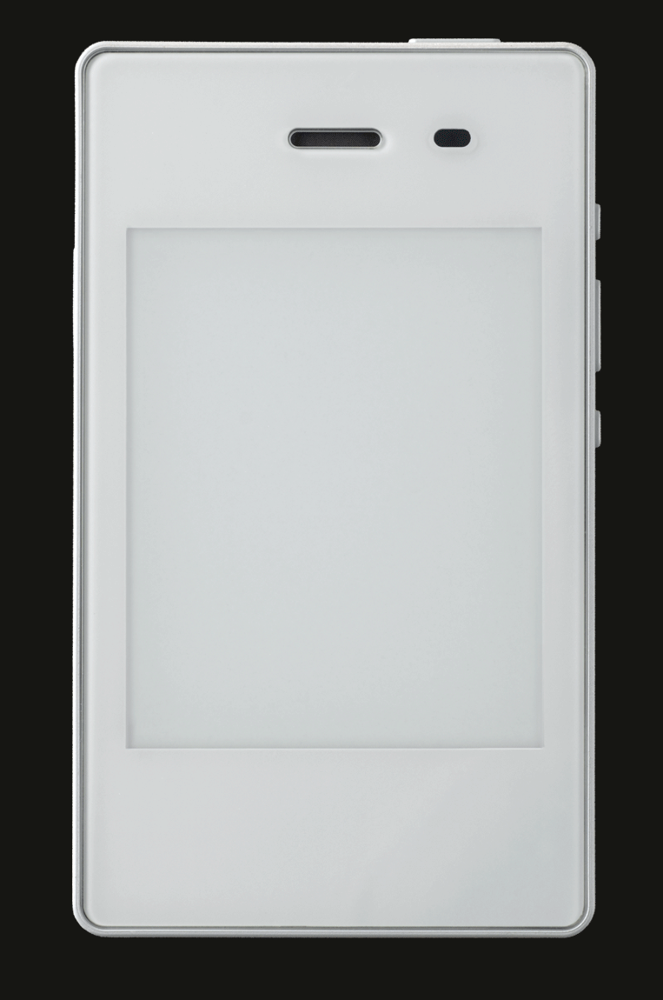
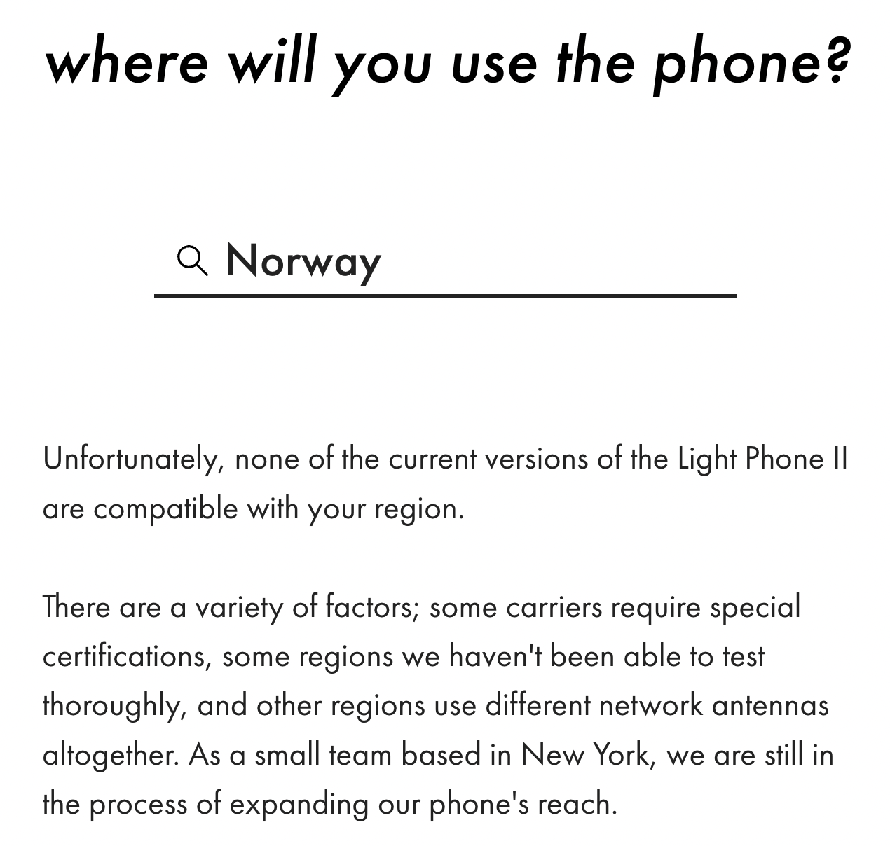

+++
draft = false
date = 2022-11-08T11:09:30+01:00
title = "Why I'm not using the Lightphone II (but my daughter is)"
description = "I really want to, though. And you should too!"
tags = ["tech life", "digital minimalism", "dumbphone"]
+++

# What's a Light Phone, and why are there two of them?

The original Light Phone was a seriously dumb device. No texting, only phone calls. The company behind it never meant for it to be your only device, but a device to bring when you were "going light" – detaching yourself from all the digital clutter of your everyday (social media, feeds, notifications ++). It was a big a hit as one might expect, I guess, but quite a few people found the experience delightfully refreshing – but definitely not sustainable. After all, we need a few more bare essentials than just phone calls. Right?

## Light Phone II

The [Light Phone II](https://www.thelightphone.com/products?ref=lightphone-ii) is still "designed to be used as little as possible", and the box calls it:
> ...a premium, minimal phone. It will never have social media, clickbait news, email, an internet browser, or any other anxiety-inducing infinite feed.

What it _does_ have, however, is "Tools". Nothing fancy, but "Directions" (Google Maps without Google, and basically also without the maps I guess), a podcast app and an offline music app. And then some, but seriously not much. It also sports an e-ink display, which is not great when there's a lot of motion, but it feels refreshingly "analog" (think Kindle vs iPad). Also, if you get an MMS, it will be auto-forwarded to your email, which is not a bad idea. You get an online dashboard for uploading music like it's 2001 and managing your contacts. Perfect.

## How does it feel?

Awesome! And a bit scary, to be honest. I propose for a lot of us, switching to this device would be the single most effective thing to do in order to detach from our too-online everyday life. A great and brutal way to get both your brain, soul, sound sleep and attention back. Yes, it's a bit tricky to text, and the unresponsive feel of the screen is a bit of a hassle. But that's actually kind of the point: you won't pick up your phone every idle moment, you'll instead figure out something else to do with your thoughts and your presence. Like think, process, dream, pray, ponder, wonder – things most of us have traded with Insta this, Snap that, Tic Toc whatever.

## So am I using it?

This is the sad part; I'm really not. I wanted to, soooo badly. Here's why I ended up giving it to my daughter instead (who btw loves it)

- Dealbreaker: [Norwegian carriers are really not friends with the Light Phone](https://www.thelightphone.com/compatibility-checker?ref=lightphone-ii)
    - TL;DR: I need to choose between a plan that support making calls (ie Voice Over LTE, VOLTE) _or_ a plan that supports cellular data all the other places (forwarding MMS messages, Directions app, Podcasts, syncing contacts etc). I obviously can't live without phone calls, and not having cellular data is also quite a big deal. I hope this will change soon!
- Semi-dealbraker: Messaging. With iPhone people, this sort of works because iMessage gets "downgraded" to SMS/MMS without making a fuzz. I won't see their images until I check my email, but I get the gist of what's going on. But most Android people in my network prefer Facebook Messenger, which this phone obviously doesn't support. Nor should it! And I'm not saying this is a flaw in the Light Phone II, but it makes things inconvenient. (I also pick my battles; I could go "you _must_ reach out to me via SMS only, Facebook is evil", but I'm not sure that I want to be that guy right now.)
- Not a dealbreaker: it can't run Vipps, or any other convenient means of payment. (The two months I used the Light Phone II, I had my Curve card glued to the back of it :D)
- Not a dealbreaker: I can't use my phone to pay for parking. Of all the things I thought I'd miss, EasyPark is the only "healthy" one.

## Should you use it?

It depends. If it's [fully supported by your carrier](https://www.thelightphone.com/compatibility-checker?ref=lightphone-ii), and you can live without EasyPark, Vipps or [insert super-important app that you think you need]; go for it.

Check it out [here](https://www.thelightphone.com/products?ref=lightphone-ii).

[r/LightPhone](https://www.reddit.com/r/LightPhone/), is btw a quite interesting place to read more and share experiences!

## My daughter, btw

...is 8 years old at the time of writing. I don't want her to have a smartphone any time soon, and the "calls and texts only" functionality of my Light Phone 2 running on a semi-broken carrier is just what she needs. To be fair, a cheaper dumbphone would suit her equally well :P
